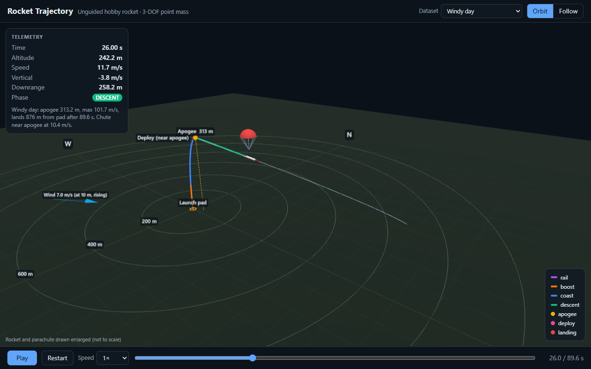
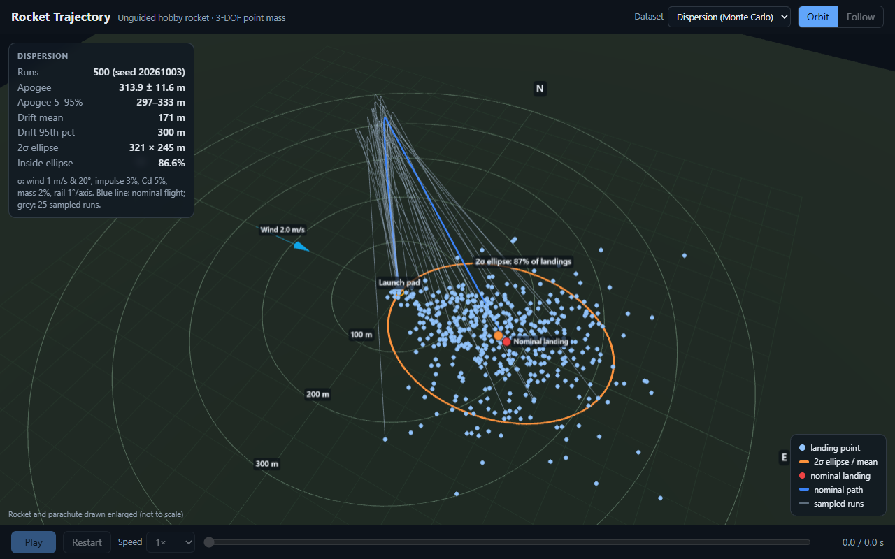
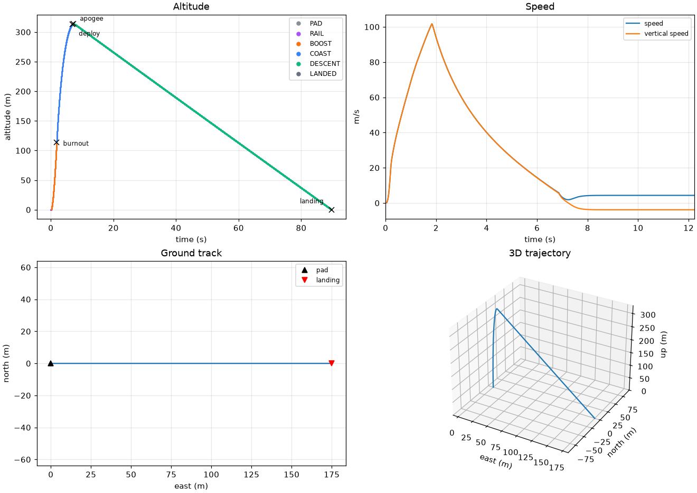
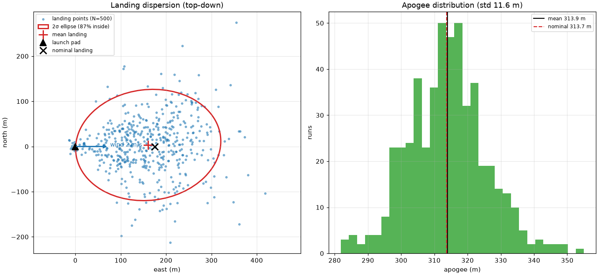

# rocket-sim: 3D hobby-rocket trajectory simulator

A 3-degree-of-freedom (point-mass) trajectory simulator for an **unguided hobby
model rocket**, with a test suite that validates the physics against closed-form
results, a Monte Carlo landing-dispersion analysis, and a browser-based 3D viewer
(three.js) deployed to GitHub Pages.

> **Scope.** This is an unguided hobby-rocket simulator. It has no guidance,
> control, steering, targeting or aiming logic of any kind: the rocket flies
> wherever physics sends it. All inputs are textbook physics and published
> hobby-motor data.

**Live viewer:** `https://<your-github-user>.github.io/<repo-name>/` (after enabling Pages, see [Deploy](#ci-and-deploy))



<!-- GIF placeholder: record a short screen capture of the viewer playing the
     default flight and save it as docs/demo.gif, then uncomment:
 -->

| Monte Carlo dispersion in the viewer | Single-flight plots (`run_flight.py`) |
|---|---|
|  |  |

---

## Quickstart

Requires Python 3.11+.

```bash
python -m venv .venv
# Windows: .venv\Scripts\activate      macOS/Linux: source .venv/bin/activate
pip install -r requirements.txt

python -m pytest                       # 93 tests, ~30 s
python scripts/run_flight.py           # one flight: summary + out/flight/{flight.json,flight.png}
python scripts/run_montecarlo.py       # 500 dispersed flights: stats + out/montecarlo/*
python scripts/build_site.py           # regenerate all viewer data into web/data/

cd web && python -m http.server 8000   # then open http://localhost:8000
```

Example output of `run_flight.py` (default config):

```
Motor            : C6  (8.82 N*s, burn 1.86 s)
Apogee           : 313.7 m  (1029 ft) at t = 7.24 s
Max speed        : 101.7 m/s
Flight time      : 89.8 s  (landed: True)
Landing distance : 175.0 m from pad  (east +175.0 m, north +0.0 m)
Deploy           : t = 6.86 s, near apogee (-0.56 s vs true apogee at 7.42 s), speed 5.8 m/s, altitude 312.9 m
```

Any config value can be overridden from the command line:

```bash
python scripts/run_flight.py --set wind.speed_mps=6 --set launch.tilt_deg=5 --set launch.azimuth_deg=270
python scripts/run_flight.py --set recovery.deploy_delay_s=0     # what if the chute opens at burnout?
```

---

## Physics model

Frame: flat Earth, **x = east, y = north, z = up**, origin at the launch pad, SI units.
State: position **p**, velocity **v**, mass *m* (one numpy vector `[px, py, pz, vx, vy, vz, m]`), time *t*.

**Equations of motion**

$$\dot{\mathbf p} = \mathbf v,\qquad m\,\dot{\mathbf v} = \mathbf T + m\mathbf g + \mathbf D,\qquad \dot m = -\frac{m_\text{prop}}{I_\text{total}}\,T(t)$$

| Term | Model |
|---|---|
| Gravity | $\mathbf g = (0, 0, -9.81)$ m/s², constant |
| Thrust magnitude | Linear interpolation of a RASP `.eng` thrust curve (implicit (0, 0) start point); zero after burnout |
| Thrust direction | Along the rail while on the rail; afterwards along the unit velocity $\hat{\mathbf v}$ (gravity turn) |
| Mass flow | Proportional to thrust, so the propellant is used up exactly at burnout |
| Drag | $\mathbf D = -\tfrac12\,\rho(z)\,C_d\,A\,\lvert\mathbf v_\text{rel}\rvert\,\mathbf v_\text{rel}$, with $\mathbf v_\text{rel} = \mathbf v - \mathbf w(z)$ |
| Reference area | Body: $A = \pi d^2/4$ from body diameter. After deployment the chute's $C_d$ and area **replace** the body's |
| Atmosphere | ISA troposphere $\rho(h) = \rho_0\,(T(h)/T_0)^{g/(RL)-1}$ with $T = T_0 - Lh$ (isothermal above 11 km) |
| Wind | $\lvert\mathbf w\rvert = w_0$ at or below $z_\text{ref}$ = 10 m, $w_0\,(z/z_\text{ref})^\alpha$ above; horizontal. Wind enters **only** through $\mathbf v_\text{rel}$ in drag |

**Launch rail.** While on the rail the rocket is a bead on a wire: only the net-force
component along the rail direction **u** accelerates it. It stays on the pad until
thrust beats the along-rail weight, and it cannot slide below the pad. Rail
direction: tilt measured from vertical, azimuth as a compass heading (0 = north, 90 = east).

**Flight phases** (stored per sample): `PAD → RAIL → BOOST → COAST → DESCENT → LANDED`.
Apogee is an *event* (vertical velocity crosses zero) that marks the COAST → DESCENT
transition. Events recorded with time, position and velocity: liftoff, rail exit,
burnout, deploy, apogee, landing.

**Parachute.** Deploys at burnout + ejection delay (configurable; defaults to the
motor's delay, 5 s for a C6-5). The deployment is classified as *before*, *near*
(within ±1 s) or *after* the **true apogee**, defined as where the rocket would
have peaked with no parachute. If the chute opens while the rocket is still
climbing, the chute itself causes an early "apogee"; comparing against that would
mislabel a high-speed early deployment as "near". So in that case a chute-free
shadow copy of the coast is integrated to find the true apogee.

### Numerical methods

* **RK4** (default) and **semi-implicit (symplectic) Euler** fixed-step integrators,
  both operating on the same state vector. Euler is kept as an independent cross-check.
* **Known discontinuities are stepped onto exactly.** These are every thrust-curve
  node, burnout, and the deploy time. RK4 is only 4th-order accurate on smooth
  segments, so stepping across a kink silently drops it to low order.
* **Left-limit evaluation:** RK4 stages at the end of a step use the time just
  before the step boundary. Without this, the step that ends exactly at burnout
  evaluates k4 with zero thrust and loses about 1/6 of its impulse.
* **State events** are located inside the step: liftoff by bisection (thrust =
  along-rail weight), rail exit by Newton iteration with the step *split* at the
  exit (the dynamics change there), apogee and ground contact by linear
  interpolation.
* **Stiffness guard:** a chute opened at high speed has a velocity time constant
  τ = m/(ρ C_d A |v|) of about 10 ms. The step is capped at τ/2 while the chute is
  out, so coarse Monte Carlo steps stay stable.

Resulting accuracy for the default flight: apogee agrees to 0.1 mm between
dt = 1 ms and dt = 20 ms. The default single-flight step is dt = 5 ms (≈0.6 s per
flight); Monte Carlo uses dt = 50 ms (≈0.06 s per flight).

---

## Default rocket and every default value

| Parameter | Value | Source / assumption |
|---|---|---|
| Motor | Estes C6, delay 5 s | Thrust curve: NAR certification data via the thrustcurve.org API (8.82 N·s, 1.86 s burn, 10.8 g propellant, 24.1 g loaded; header in `data/motors/Estes_C6.eng`) |
| Body diameter | 24.8 mm | Estes BT-50 body tube OD (0.976 in), common for 18 mm-motor rockets |
| Dry mass (no motor) | 40 g | Assumption: typical small BT-50 sport rocket with recovery gear |
| Body C_d | 0.75 | Typical hobby-rocket value; assumed constant (no Mach or Reynolds dependence) |
| Parachute | 12 in (0.305 m), C_d 0.8 | Assumption: common hobby chute size; flat circular canopy C_d ≈ 0.75–0.8 on nominal area (Knacke, *Parachute Recovery Systems Design Manual*) |
| Rail | 1.0 m, vertical | Project default (hobby launch rods are about 0.9–1 m) |
| Atmosphere | ISA: ρ₀ = 1.225 kg/m³, T₀ = 288.15 K, L = 6.5 K/km | International Standard Atmosphere / US Standard Atmosphere 1976 |
| Gravity | 9.81 m/s², constant | Flat-Earth approximation |
| Wind | 2 m/s toward east, uniform with height | Assumption: light breeze. Reference height 10 m = standard anemometer height |
| Wind shear exponent | 0 (off); 1/7 in the "windy" scenario | Classic open-terrain power-law exponent |
| Step size | 5 ms (single flight), 50 ms (Monte Carlo) | Chosen from convergence tests (see Testing) |

All of these live in [`configs/default.json`](configs/default.json), which lists every field explicitly.

---

## Assumptions and limitations

* **Point mass, 3 DOF.** No rotation, attitude dynamics, stability margin or
  angle of attack. Thrust is assumed to point along the velocity vector. A real
  stable rocket *weathercocks* into the relative wind, so in crosswind this model
  understates upwind turning during boost, and its downwind drift is a
  simplification.
* Constant C_d (no Mach, Reynolds, or power-on/off differences). Peak speed is
  about 100 m/s (Mach 0.3), so compressibility is negligible.
* Parachute opens **instantly** at full area (no inflation time, no snatch load),
  and its drag replaces body drag. Rocket and chute descend as one point.
* Flat, non-rotating Earth; constant g; ISA atmosphere with no humidity or
  temperature offsets. The launch altitude only shifts the density lookup.
* Wind is horizontal and steady (no gusts or turbulence); the power-law profile is optional.
* Tabulated motor thrust is certification-average data. Real motors vary, and the
  Monte Carlo models this as a ±3 % (1σ) impulse scale.
* Monte Carlo dispersion magnitudes are engineering judgement, not measured data.
* **Data provenance:** the Estes C6 curve is the published NAR certification curve,
  downloaded from thrustcurve.org. Network access was available, so the
  approximate-data fallback was not needed. **No approximate data is used.**

---

## How the tests validate the physics

`python -m pytest`: 93 tests, all passing on Python 3.11 and 3.12. Each test
compares the simulator with an independent answer: a closed-form solution, a
conservation law, a published value, or a property any correct implementation must have.

| Area | What is checked | Tolerance |
|---|---|---|
| Ballistics (vacuum, zero thrust) | Range = v₀² sin 2θ / g and max height = (v₀ sin θ)²/2g at 4 angles | 0.1 % |
| | Time up = time down; time up = v₀ sin θ / g | 10 µs; 1e-6 rel |
| | Mechanical energy conserved (RK4 / symplectic Euler) | 1e-7 / 1e-3 rel |
| Convergence | Halving dt changes apogee | < 1e-6 rel |
| | Semi-implicit Euler error halves when dt halves (first order) | ratio 1.6–2.4 |
| | RK4 vs semi-implicit Euler: apogee and range | 0.5 % |
| Constraints | No point below ground; ground contact interpolated to z = 0 exactly | exact |
| | On-rail points collinear with the rail; exit exactly at rail length; underpowered rocket never leaves the pad | 1e-12 m |
| Motor | Integrated thrust curve = published total impulse 8.82 N·s | 1 % (actual 0.03 %) |
| | Header parsing, linear interpolation, zero outside burn, malformed files rejected | exact |
| | Mass at burnout = initial − propellant; mass never increases | 1e-7 kg |
| Atmosphere / drag | ρ(0) = 1.225, strictly decreasing to 20 km, matches ISA table at 1, 5, 11 km | 0.2 % |
| | Drag formula and direction; drag lowers apogee | exact |
| Recovery | Descent speed → terminal velocity √(2mg / ρ C_d A) | 2 % |
| | Deploy time = burnout + delay; before/near/after classification; true apogee = a real no-chute flight | 1 cm |
| Phases / events | Valid order, no repeats, every phase visited in nominal flights; apogee is where v_z crosses 0 | exact |
| Wind | Wind toward +x moves landing toward +x; zero wind + vertical = lands at origin; in vacuum wind has *no* effect | 1e-9 m |
| Export | JSON structure, strictly increasing time, sample count = 60 Hz × duration, samples/phases/events match the simulation | 1 mm |
| Monte Carlo | Same seed → identical; different seed → different; serial = parallel; zero dispersion → every run equals nominal | exact |
| | Stats on hand-computed synthetic data; rotated-covariance ellipse; 2σ coverage = 1 − e⁻² on Gaussian samples | 1e-9 / 1 % |
| | Coarse MC dt vs fine dt on dispersed configs and on a 100 m/s deployment | 1e-4 apogee, 5 cm landing |
| Config | Unknown keys and invalid values rejected; overrides parsed | — |

Bugs these tests caught during development (each fixed in the model, never by loosening a test):
1. The rail-exit overshoot was integrated with the rail still constraining the rocket, an O(dt) error.
2. RK4's last stage saw zero thrust on the step ending at burnout.
3. Propellant burned during the pad hold was not subtracted.
4. Deploy timing was compared against the chute-induced apogee instead of the true apogee.

**Viewer check.** `python scripts/check_viewer.py` serves `web/`, loads every
dataset in headless Chrome or Edge, and asserts the page reports `ready`, renders
a frame, and logs zero JS errors. It also checks that a missing data file shows a
visible error message. It is a dev check, not part of pytest, because it needs a
local browser and network access to the three.js CDN.

---

## Monte Carlo dispersion

```bash
python scripts/run_montecarlo.py                                   # 500 runs, seed 20261003
python scripts/run_montecarlo.py --n 1000 --seed 1 --workers 8
python scripts/run_montecarlo.py --set wind.speed_mps=5 --wind-sigma 2 --angle-sigma 2
```

Every quantity is drawn from a normal distribution truncated at ±3σ. All draws
for all runs come up front from one seeded PCG64 stream, so results do not depend
on the number of worker processes (tested).

| Quantity | Perturbation | Default 1σ |
|---|---|---|
| Wind speed | nominal + N(0, σ), clipped at ≥ 0 | 1.0 m/s |
| Wind direction | nominal + N(0, σ) | 20° |
| Motor total impulse | whole thrust curve × (1 + N(0, σ)) | 3 % |
| Body C_d | × (1 + N(0, σ)) | 5 % |
| Dry mass | × (1 + N(0, σ)) | 2 % |
| Rail pointing | independent rotations toward east and toward north | 1° each |

**Outputs:**
* Landing points, apogees and flight times for every run.
* Summary stats: mean and sample standard deviation of the landing point, drift distance (mean, std, 95th percentile, max), and apogee (mean, std, 5th and 95th percentiles).
* A **2σ landing ellipse** from the eigen-decomposition of the landing covariance, with the fraction of runs actually inside it. Note: for a 2D Gaussian a 2σ ellipse holds 1 − e⁻² ≈ 86.5 % of points, not 95 %; the 95 % ellipse is 2.45σ.
* A top-down scatter plot with the ellipse, and an apogee histogram.

Default result (500 runs, ≈7 s on 15 cores, ≈30 s single-core):
* Apogee 313.9 ± 11.6 m.
* Mean drift 171 m; 95th-percentile drift 300.5 m.
* 2σ ellipse 321 × 245 m, containing 86.6 % of landings.



---

## 3D viewer

A single static page (`web/index.html` + `main.js` + `style.css`). three.js 0.170.0
and OrbitControls load from jsdelivr through an import map, so there is no build
step and no npm.

* Ground grid with distance rings, compass labels, launch pad, and wind arrow.
* Rocket mesh oriented along its velocity; exhaust trail during boost; phase-coloured
  path drawn as it flies; parachute inflating at deploy; apogee, deploy and landing markers.
* Camera modes: free orbit and follow-rocket. Live telemetry panel.
* Playback: play/pause, restart, 0.25×–4× speed, scrub slider; space bar toggles play.
* **Dispersion** mode: all Monte Carlo landing points, the 2σ ellipse, the nominal
  path, 25 sampled trajectories, and a stats panel.
* Responsive (desktop and phone), follows the OS light/dark setting, and shows a
  visible error if data fails to load.
* URL parameters: `?data=windy`, `?t=12` (start paused at 12 s), `?cam=follow`.

The rocket and parachute are drawn enlarged; the page notes this. A real 30 cm
rocket would be invisible at 300 m.

---

## CI and deploy

* [`.github/workflows/tests.yml`](.github/workflows/tests.yml): runs pytest on Python 3.11 on every push and pull request.
* [`.github/workflows/pages.yml`](.github/workflows/pages.yml): on push to `main`, installs dependencies, runs the tests (so unverified physics is never published), runs `build_site.py`, and deploys `web/` to GitHub Pages.

One-time setup: **Settings → Pages → Build and deployment → Source: GitHub Actions**.

Generated data (`web/data/*.json`) is git-ignored; CI rebuilds it, and locally you run `scripts/build_site.py`.

---

## Project structure

```
rocket-sim/
  sim/
    config.py        dataclasses for rocket, motor, launch, atmosphere, wind, recovery, sim; strict JSON loading, overrides
    motor.py         RASP .eng loader, piecewise-linear thrust, mass flow, impulse scaling
    atmosphere.py    ISA density
    physics.py       gravity, thrust direction, drag, wind profile, rail constraint, stiffness step limit
    integrator.py    RK4 and semi-implicit Euler steps
    flight.py        run loop, phases, events, deploy-timing classification
    montecarlo.py    seeded dispersions, parallel runs, statistics, ellipse
    export.py        JSON for the viewer (60 Hz resampled flights, dispersion datasets)
  data/motors/Estes_C6.eng
  configs/default.json
  tests/             93 pytest tests, organised by milestone (test_m1_core.py ... test_m5_montecarlo.py, test_config.py)
  scripts/
    run_flight.py        one flight -> summary, JSON, plots
    run_montecarlo.py    N flights -> stats, JSON, scatter + histogram
    build_site.py        regenerate web/data/ (default, windy, angled, dispersion)
    check_viewer.py      headless-browser smoke test of the viewer
  web/               index.html, main.js, style.css, data/ (generated)
  docs/              screenshots used in this README
  .github/workflows/ tests.yml, pages.yml
```
