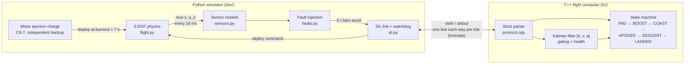

# rocket-sim: 3D hobby-rocket trajectory simulator

A 3-degree-of-freedom (point-mass) trajectory simulator for an **unguided hobby
model rocket**, with a test suite that validates the physics against closed-form
results, a Monte Carlo landing-dispersion analysis, and a browser-based 3D viewer
(three.js) deployed to GitHub Pages.

> **Scope.** This is an unguided hobby-rocket simulator. It has no guidance,
> control, steering, targeting or aiming logic of any kind: the rocket flies
> wherever physics sends it. All inputs are textbook physics and published
> hobby-motor data.

**Live viewer:** `https://<your-github-user>.github.io/<repo-name>/` (after enabling Pages, see [Deploy](#ci-and-deploy))


<!-- GIF placeholder: record a short screen capture of the viewer playing the
     default flight and save it as docs/demo.gif, then uncomment:
 -->

| Monte Carlo dispersion in the viewer | Single-flight plots (`run_flight.py`) |
|---|---|
|  |  |

---

## Quickstart

Requires Python 3.11+.

```bash
python -m venv .venv
# Windows: .venv\Scripts\activate      macOS/Linux: source .venv/bin/activate
pip install -r requirements.txt

python -m pytest                       # 362 tests (93 physics + 106 SIL + 163 fleet), ~5 min; SIL needs fc/ built
python scripts/run_flight.py           # one flight: summary + out/flight/{flight.json,flight.png}
python scripts/run_montecarlo.py       # 500 dispersed flights: stats + out/montecarlo/*
python scripts/build_site.py           # regenerate all viewer data into web/data/

cd web && python -m http.server 8000   # then open http://localhost:8000
```

Example output of `run_flight.py` (default config):

```
Motor            : C6  (8.82 N*s, burn 1.86 s)
Apogee           : 313.7 m  (1029 ft) at t = 7.24 s
Max speed        : 101.7 m/s
Flight time      : 89.8 s  (landed: True)
Landing distance : 175.0 m from pad  (east +175.0 m, north +0.0 m)
Deploy           : t = 6.86 s, near apogee (-0.56 s vs true apogee at 7.42 s), speed 5.8 m/s, altitude 312.9 m
```

Any config value can be overridden from the command line:

```bash
python scripts/run_flight.py --set wind.speed_mps=6 --set launch.tilt_deg=5 --set launch.azimuth_deg=270
python scripts/run_flight.py --set recovery.deploy_delay_s=0     # what if the chute opens at burnout?
```

---

## Physics model

Frame: flat Earth, **x = east, y = north, z = up**, origin at the launch pad, SI units.
State: position **p**, velocity **v**, mass *m* (one numpy vector `[px, py, pz, vx, vy, vz, m]`), time *t*.

**Equations of motion**

$$\dot{\mathbf p} = \mathbf v,\qquad m\,\dot{\mathbf v} = \mathbf T + m\mathbf g + \mathbf D,\qquad \dot m = -\frac{m_\text{prop}}{I_\text{total}}\,T(t)$$

| Term | Model |
|---|---|
| Gravity | $\mathbf g = (0, 0, -9.81)$ m/s², constant |
| Thrust magnitude | Linear interpolation of a RASP `.eng` thrust curve (implicit (0, 0) start point); zero after burnout |
| Thrust direction | Along the rail while on the rail; afterwards along the unit velocity $\hat{\mathbf v}$ (gravity turn) |
| Mass flow | Proportional to thrust, so the propellant is used up exactly at burnout |
| Drag | $\mathbf D = -\tfrac12\,\rho(z)\,C_d\,A\,\lvert\mathbf v_\text{rel}\rvert\,\mathbf v_\text{rel}$, with $\mathbf v_\text{rel} = \mathbf v - \mathbf w(z)$ |
| Reference area | Body: $A = \pi d^2/4$ from body diameter. After deployment the chute's $C_d$ and area **replace** the body's |
| Atmosphere | ISA troposphere $\rho(h) = \rho_0\,(T(h)/T_0)^{g/(RL)-1}$ with $T = T_0 - Lh$ (isothermal above 11 km) |
| Wind | $\lvert\mathbf w\rvert = w_0$ at or below $z_\text{ref}$ = 10 m, $w_0\,(z/z_\text{ref})^\alpha$ above; horizontal. Wind enters **only** through $\mathbf v_\text{rel}$ in drag |

**Launch rail.** While on the rail the rocket is a bead on a wire: only the net-force
component along the rail direction **u** accelerates it. It stays on the pad until
thrust beats the along-rail weight, and it cannot slide below the pad. Rail
direction: tilt measured from vertical, azimuth as a compass heading (0 = north, 90 = east).

**Flight phases** (stored per sample): `PAD → RAIL → BOOST → COAST → DESCENT → LANDED`.
Apogee is an *event* (vertical velocity crosses zero) that marks the COAST → DESCENT
transition. Events recorded with time, position and velocity: liftoff, rail exit,
burnout, deploy, apogee, landing.

**Parachute.** Deploys at burnout + ejection delay (configurable; defaults to the
motor's delay, 5 s for a C6-5). The deployment is classified as *before*, *near*
(within ±1 s) or *after* the **true apogee**, defined as where the rocket would
have peaked with no parachute. If the chute opens while the rocket is still
climbing, the chute itself causes an early "apogee"; comparing against that would
mislabel a high-speed early deployment as "near". So in that case a chute-free
shadow copy of the coast is integrated to find the true apogee.

### Numerical methods

* **RK4** (default) and **semi-implicit (symplectic) Euler** fixed-step integrators,
  both operating on the same state vector. Euler is kept as an independent cross-check.
* **Known discontinuities are stepped onto exactly.** These are every thrust-curve
  node, burnout, and the deploy time. RK4 is only 4th-order accurate on smooth
  segments, so stepping across a kink silently drops it to low order.
* **Left-limit evaluation:** RK4 stages at the end of a step use the time just
  before the step boundary. Without this, the step that ends exactly at burnout
  evaluates k4 with zero thrust and loses about 1/6 of its impulse.
* **State events** are located inside the step: liftoff by bisection (thrust =
  along-rail weight), rail exit by Newton iteration with the step *split* at the
  exit (the dynamics change there), apogee and ground contact by linear
  interpolation.
* **Stiffness guard:** a chute opened at high speed has a velocity time constant
  τ = m/(ρ C_d A |v|) of about 10 ms. The step is capped at τ/2 while the chute is
  out, so coarse Monte Carlo steps stay stable.

Resulting accuracy for the default flight: apogee agrees to 0.1 mm between
dt = 1 ms and dt = 20 ms. The default single-flight step is dt = 5 ms (≈0.6 s per
flight); Monte Carlo uses dt = 50 ms (≈0.06 s per flight).

---

## Default rocket and every default value

| Parameter | Value | Source / assumption |
|---|---|---|
| Motor | Estes C6, delay 5 s | Thrust curve: NAR certification data via the thrustcurve.org API (8.82 N·s, 1.86 s burn, 10.8 g propellant, 24.1 g loaded; header in `data/motors/Estes_C6.eng`) |
| Body diameter | 24.8 mm | Estes BT-50 body tube OD (0.976 in), common for 18 mm-motor rockets |
| Dry mass (no motor) | 40 g | Assumption: typical small BT-50 sport rocket with recovery gear |
| Body C_d | 0.75 | Typical hobby-rocket value; assumed constant (no Mach or Reynolds dependence) |
| Parachute | 12 in (0.305 m), C_d 0.8 | Assumption: common hobby chute size; flat circular canopy C_d ≈ 0.75–0.8 on nominal area (Knacke, *Parachute Recovery Systems Design Manual*) |
| Rail | 1.0 m, vertical | Project default (hobby launch rods are about 0.9–1 m) |
| Atmosphere | ISA: ρ₀ = 1.225 kg/m³, T₀ = 288.15 K, L = 6.5 K/km | International Standard Atmosphere / US Standard Atmosphere 1976 |
| Gravity | 9.81 m/s², constant | Flat-Earth approximation |
| Wind | 2 m/s toward east, uniform with height | Assumption: light breeze. Reference height 10 m = standard anemometer height |
| Wind shear exponent | 0 (off); 1/7 in the "windy" scenario | Classic open-terrain power-law exponent |
| Step size | 5 ms (single flight), 50 ms (Monte Carlo) | Chosen from convergence tests (see Testing) |

All of these live in [`configs/default.json`](configs/default.json), which lists every field explicitly.

---

## Assumptions and limitations

* **Point mass, 3 DOF.** No rotation, attitude dynamics, stability margin or
  angle of attack. Thrust is assumed to point along the velocity vector. A real
  stable rocket *weathercocks* into the relative wind, so in crosswind this model
  understates upwind turning during boost, and its downwind drift is a
  simplification.
* Constant C_d (no Mach, Reynolds, or power-on/off differences). Peak speed is
  about 100 m/s (Mach 0.3), so compressibility is negligible.
* Parachute opens **instantly** at full area (no inflation time, no snatch load),
  and its drag replaces body drag. Rocket and chute descend as one point.
* Flat, non-rotating Earth; constant g; ISA atmosphere with no humidity or
  temperature offsets. The launch altitude only shifts the density lookup.
* Wind is horizontal and steady (no gusts or turbulence); the power-law profile is optional.
* Tabulated motor thrust is certification-average data. Real motors vary, and the
  Monte Carlo models this as a ±3 % (1σ) impulse scale.
* Monte Carlo dispersion magnitudes are engineering judgement, not measured data.
* **Data provenance:** the Estes C6 curve is the published NAR certification curve,
  downloaded from thrustcurve.org. Network access was available, so the
  approximate-data fallback was not needed. **No approximate data is used.**

---

## How the tests validate the physics

`python -m pytest`: 93 physics tests (plus 106 SIL and 163 fleet tests, see [Software-in-the-loop flight computer](#software-in-the-loop-flight-computer) and [The fleet](#the-fleet)), all passing. Each physics test
compares the simulator with an independent answer: a closed-form solution, a
conservation law, a published value, or a property any correct implementation must have.

| Area | What is checked | Tolerance |
|---|---|---|
| Ballistics (vacuum, zero thrust) | Range = v₀² sin 2θ / g and max height = (v₀ sin θ)²/2g at 4 angles | 0.1 % |
| | Time up = time down; time up = v₀ sin θ / g | 10 µs; 1e-6 rel |
| | Mechanical energy conserved (RK4 / symplectic Euler) | 1e-7 / 1e-3 rel |
| Convergence | Halving dt changes apogee | < 1e-6 rel |
| | Semi-implicit Euler error halves when dt halves (first order) | ratio 1.6–2.4 |
| | RK4 vs semi-implicit Euler: apogee and range | 0.5 % |
| Constraints | No point below ground; ground contact interpolated to z = 0 exactly | exact |
| | On-rail points collinear with the rail; exit exactly at rail length; underpowered rocket never leaves the pad | 1e-12 m |
| Motor | Integrated thrust curve = published total impulse 8.82 N·s | 1 % (actual 0.03 %) |
| | Header parsing, linear interpolation, zero outside burn, malformed files rejected | exact |
| | Mass at burnout = initial − propellant; mass never increases | 1e-7 kg |
| Atmosphere / drag | ρ(0) = 1.225, strictly decreasing to 20 km, matches ISA table at 1, 5, 11 km | 0.2 % |
| | Drag formula and direction; drag lowers apogee | exact |
| Recovery | Descent speed → terminal velocity √(2mg / ρ C_d A) | 2 % |
| | Deploy time = burnout + delay; before/near/after classification; true apogee = a real no-chute flight | 1 cm |
| Phases / events | Valid order, no repeats, every phase visited in nominal flights; apogee is where v_z crosses 0 | exact |
| Wind | Wind toward +x moves landing toward +x; zero wind + vertical = lands at origin; in vacuum wind has *no* effect | 1e-9 m |
| Export | JSON structure, strictly increasing time, sample count = 60 Hz × duration, samples/phases/events match the simulation | 1 mm |
| Monte Carlo | Same seed → identical; different seed → different; serial = parallel; zero dispersion → every run equals nominal | exact |
| | Stats on hand-computed synthetic data; rotated-covariance ellipse; 2σ coverage = 1 − e⁻² on Gaussian samples | 1e-9 / 1 % |
| | Coarse MC dt vs fine dt on dispersed configs and on a 100 m/s deployment | 1e-4 apogee, 5 cm landing |
| Config | Unknown keys and invalid values rejected; overrides parsed | — |

Bugs these tests caught during development (each fixed in the model, never by loosening a test):
1. The rail-exit overshoot was integrated with the rail still constraining the rocket, an O(dt) error.
2. RK4's last stage saw zero thrust on the step ending at burnout.
3. Propellant burned during the pad hold was not subtracted.
4. Deploy timing was compared against the chute-induced apogee instead of the true apogee.

**Viewer check.** `python scripts/check_viewer.py` serves `web/`, loads every
dataset in headless Chrome or Edge, and asserts the page reports `ready`, renders
a frame, and logs zero JS errors. It also checks that a missing data file shows a
visible error message. It is a dev check, not part of pytest, because it needs a
local browser and network access to the three.js CDN.

---

## Monte Carlo dispersion

```bash
python scripts/run_montecarlo.py                                   # 500 runs, seed 20261003
python scripts/run_montecarlo.py --n 1000 --seed 1 --workers 8
python scripts/run_montecarlo.py --set wind.speed_mps=5 --wind-sigma 2 --angle-sigma 2
```

Every quantity is drawn from a normal distribution truncated at ±3σ. All draws
for all runs come up front from one seeded PCG64 stream, so results do not depend
on the number of worker processes (tested).

| Quantity | Perturbation | Default 1σ |
|---|---|---|
| Wind speed | nominal + N(0, σ), clipped at ≥ 0 | 1.0 m/s |
| Wind direction | nominal + N(0, σ) | 20° |
| Motor total impulse | whole thrust curve × (1 + N(0, σ)) | 3 % |
| Body C_d | × (1 + N(0, σ)) | 5 % |
| Dry mass | × (1 + N(0, σ)) | 2 % |
| Rail pointing | independent rotations toward east and toward north | 1° each |

**Outputs:**
* Landing points, apogees and flight times for every run.
* Summary stats: mean and sample standard deviation of the landing point, drift distance (mean, std, 95th percentile, max), and apogee (mean, std, 5th and 95th percentiles).
* A **2σ landing ellipse** from the eigen-decomposition of the landing covariance, with the fraction of runs actually inside it. Note: for a 2D Gaussian a 2σ ellipse holds 1 − e⁻² ≈ 86.5 % of points, not 95 %; the 95 % ellipse is 2.45σ.
* A top-down scatter plot with the ellipse, and an apogee histogram.

Default result (500 runs, ≈7 s on 15 cores, ≈30 s single-core):
* Apogee 313.9 ± 11.6 m.
* Mean drift 171 m; 95th-percentile drift 300.5 m.
* 2σ ellipse 321 × 245 m, containing 86.6 % of landings.


---

## 3D viewer

A single static page (`web/index.html` + `main.js` + `style.css`). three.js 0.170.0
and OrbitControls load from jsdelivr through an import map, so there is no build
step and no npm.

* Ground grid with distance rings, compass labels, launch pad, and wind arrow.
* Rocket mesh oriented along its velocity; exhaust trail during boost; phase-coloured
  path drawn as it flies; parachute inflating at deploy; apogee, deploy and landing markers.
* Camera modes: free orbit and follow-rocket. Live telemetry panel.
* Playback: play/pause, restart, 0.25×–4× speed, scrub slider; space bar toggles play.
* **Dispersion** mode: all Monte Carlo landing points, the 2σ ellipse, the nominal
  path, 25 sampled trajectories, and a stats panel.
* Responsive (desktop and phone), follows the OS light/dark setting, and shows a
  visible error if data fails to load.
* URL parameters: `?data=windy`, `?t=12` (start paused at 12 s), `?cam=follow`.
* **Rocket picker.** The dataset menu is grouped into Flights, Flight
  computer, Fleet and Monte Carlo. Each fleet rocket is drawn as a procedural
  model built from its real dimensions: lathe-turned nose and body,
  trapezoidal fins. Radial sizes are exaggerated 2.5×, because high-power
  rockets are too slender to see at true proportions.
* **Two-stage separation.** The booster rides under the sustainer until
  separation, then falls along its own (dashed) path, with its own chute, to
  "Booster lands". Dual-deploy rockets show the canopy growing when the main
  opens. `?dist=<m>` sets the follow-camera distance.
* **SIL datasets** ("SIL nominal", "SIL faults"):
  * The telemetry panel adds the FC's state and its altitude and velocity
    estimates.
  * A "Flight computer" chart overlays the estimated and true altitude, with
    the raw barometer, shaded fault intervals and dropped frames, the true
    apogee, and the FC's deploy decision. An Ascent/Full toggle switches the
    range.
  * The 3D deploy marker names the mechanism that fired.

The rocket and parachute are drawn enlarged; the page notes this. A real 30 cm
rocket would be invisible at 300 m.

---

## Software-in-the-loop flight computer

A separate **C++17 flight computer** (FC), in [`fc/`](fc/), flies the simulated
rocket in closed loop. The Python simulator generates noisy barometer and
accelerometer readings at 100 Hz. The FC decides when to deploy the parachute,
and the simulator applies that decision to the physics.

> **Scope.** The FC **only detects flight events and commands parachute
> deployment**. It has no steering, guidance, attitude control or targeting.
> Its single output is one bit.

Further reading:
* [docs/fc_walkthrough.md](docs/fc_walkthrough.md): every threshold, design
  decision and rejected alternative.
* [docs/requirements.md](docs/requirements.md): the requirements.
* [docs/verification_report.md](docs/verification_report.md): generated
  evidence.
* [docs/protocol.md](docs/protocol.md): the interface.

### Architecture



* **Lockstep.** Each tick the simulator sends one line and blocks for exactly
  one reply. The FC's only clock is the frame timestamp, so runs are
  deterministic: the same seed gives byte-identical output.
* **Watchdog.** No reply within the timeout, or the process exits, means the
  FC is declared failed. The motor charge still deploys.
* **Three deployment layers.**
  1. The FC's apogee detector.
  2. The FC's backup timer, at launch + 8.5 s.
  3. The motor's ejection charge, at burnout + 7 s.

  Each one covers the failure of the one above it. Every run logs which one
  deployed.

### Protocol

```
Sim → FC:  S <t> <baro_alt_m> <accel_mps2>      FC → Sim:  R <t> <state> <est_alt> <est_vel> <deploy 0|1>
           END                                              E <reason>      (input line rejected)
```

* Parsing is strict on both sides: exact field counts, whole-token numbers via
  `std::from_chars`, no NaN or infinity.
* A malformed or stale reply is treated as *no command*. Garbage can never
  fire the chute.
* The deploy bit is latched.
* Health events (a stuck sensor, an inconsistent estimator) go to stderr.

Full spec: [docs/protocol.md](docs/protocol.md).

### Sensors and fault model

| Sensor | Model (assumed hardware) | Noise | Bias | Other |
|---|---|---|---|---|
| Barometer | Altitude, MS5611-class | 0.5 m | +0.5 m | 0.1 m quantization |
| Accelerometer | Vertical **specific force**, BMI088-class (+9.81 at rest, 0 in free fall) | 0.5 m/s² | +0.2 m/s² | ±24 g saturation |

Faults ([`sim/faults.py`](sim/faults.py)), each with a start time and a
duration:
* frame **dropout** (a blackout, or random loss);
* **stuck** sensor (value frozen);
* **spikes** (outliers);
* **bias drift**;
* **FC hang** (the real process stops responding, via the test-only
  `--inject-hang-at`).

### Kalman filter

State **x** = [h, v, a]ᵀ (altitude AGL, vertical velocity, vertical kinematic
acceleration). The model is constant acceleration driven by white-noise jerk
with spectral density q, and dt comes from the frame timestamps:

$$
F=\begin{bmatrix}1&\Delta t&\tfrac12\Delta t^2\\0&1&\Delta t\\0&0&1\end{bmatrix},\qquad
Q=q\begin{bmatrix}\tfrac{\Delta t^5}{20}&\tfrac{\Delta t^4}{8}&\tfrac{\Delta t^3}{6}\\\tfrac{\Delta t^4}{8}&\tfrac{\Delta t^3}{3}&\tfrac{\Delta t^2}{2}\\\tfrac{\Delta t^3}{6}&\tfrac{\Delta t^2}{2}&\Delta t\end{bmatrix}
$$

There are two scalar measurements per frame, applied sequentially. R is
diagonal, so no matrix is ever inverted:

$$
H_b=[1\;0\;0],\; R_b=\sigma_b^2+\tfrac{\Delta_q^2}{12}=0.2508\ \text{m}^2 \qquad
H_a=[0\;0\;1],\; R_a=\sigma_a^2=0.25\ (\text{m/s}^2)^2
$$

$$
y=z-H\hat x,\quad S=HPH^\top+R,\quad K=PH^\top S^{-1},\quad
\hat x\leftarrow\hat x+Ky,\quad P\leftarrow(I-KH)P(I-KH)^\top+KRK^\top
$$

**R from the sensor model; biases are not in R.**
* R comes straight from the sensor model: white noise plus quantization
  variance.
* Biases are removed instead by references learned on the pad, where the true
  altitude and acceleration are known to be zero.

**q is tuned in closed loop.** q = 10 m²/s⁵ was chosen by a SIL sweep. The
plateau runs from 1 to 1000, and too small a q biases velocity and deploys
*early*.

**Apogee** = estimated v < 0 for 5 consecutive samples.

**Innovation gating.** A measurement with y² > 5²·S is rejected, in COAST only,
because ignition, burnout and chute snatch are real acceleration steps.

**Degradation when a sensor fails.**
* A sensor that repeats bit-identical readings is declared stuck. The FC then
  degrades gracefully:
  * stuck barometer: the filter runs on the accelerometer alone;
  * stuck accelerometer: apogee falls back to the raw-barometer detector.
* Persistent disagreement the FC can't isolate falls back to the backup timer.

Details: [walkthrough §7–8](docs/fc_walkthrough.md).

### Requirements and results

Ten requirements ([docs/requirements.md](docs/requirements.md)), including:

| ID | Requirement |
|---|---|
| REQ-001 | Deploy within 0.5 s of true apogee (nominal) |
| REQ-002 | No false launch in 1000 × 60 s pad sits |
| REQ-003 | Never deploy on the pad or under thrust, under any fault |
| REQ-004 | Under any single fault, deploy within 1.5 s or via the backup timer |
| REQ-005 | An FC hang is caught by the watchdog, and the chute still deploys |
| REQ-006 | Deterministic |

Each test is tagged with the requirements it verifies (pytest `@pytest.mark.req`,
GoogleTest `_REQnnn`).

`scripts/run_sil_montecarlo.py` flies 500 dispersed SIL flights. 60 % of them
carry one random fault from 9 classes, and every flight is flown by **both**
detectors on identical inputs. The campaign also runs 1000 pad sits.
`scripts/verification_report.py` turns the results into
[docs/verification_report.md](docs/verification_report.md): verdicts, a
traceability matrix, and replayable worst cases.

**Baseline vs Kalman**, from the current report:

| Detector | Nominal: deploy − true apogee | Nominal within 0.5 s (REQ-001) | Single faults OK (REQ-004) |
|---|---:|---:|---:|
| Baseline (raw barometer, N samples below peak) | +0.520 s | 70/207 (34 %) | 227/257 (88 %) |
| **Kalman (default)** | **+0.044 s** | **207/207 (100 %)** | **257/257 (100 %)** |

The baseline is structurally late: it must wait until the altitude has
*visibly* fallen. It is also defenceless against barometer spikes, deploying
seconds early. The Kalman FC sees apogee as its velocity estimate crosses zero.
Its remaining ~45 ms is the deliberate 5-sample confirmation window.

**Bugs the campaign found** (both fixed, with regression tests):
1. **Landing detector.** It could ping-pong between noise extremes and never
   report LANDED.
2. **Harness watchdog.** A 1 s wall-clock watchdog falsely tripped once under
   host load.

### Build and run

**Windows** (Visual Studio Build Tools 2022 with the C++ workload, and CMake):

```powershell
cmake -S fc -B fc/build
cmake --build fc/build --config Release
ctest --test-dir fc/build -C Release --output-on-failure
.venv\Scripts\python.exe -m pytest
```

**Linux** (g++ ≥ 11, CMake ≥ 3.16):

```bash
cmake -S fc -B fc/build -DCMAKE_BUILD_TYPE=Release
cmake --build fc/build --parallel
ctest --test-dir fc/build --output-on-failure
python -m pytest
```

GoogleTest is fetched by CMake, pinned to v1.17.0 by SHA-256. The simulator
finds the executable in `fc/build/` (or `$ROCKET_FC_EXE`). SIL tests **fail**,
rather than skip, if it hasn't been built.

**Running it:**

```bash
python scripts/run_sil.py                                  # one SIL flight: FC events vs truth, requirement verdicts
python scripts/run_sil.py --fault stuck:3:inf:baro         # with a fault (kind:start[:dur[:sensor[:mag[:prob]]]])
python scripts/run_sil.py --compare --seeds 50             # baseline vs Kalman on identical seeds
python scripts/run_sil_montecarlo.py                       # 500 runs x 2 detectors + 1000 pad sits (~7 min, 8 workers)
python scripts/verification_report.py                      # -> docs/verification_report.md
```

---

## The fleet

Five documented preset rockets in [`configs/rockets/`](configs/rockets/), from
a 40 g mini rocket to a two-stage sounding rocket, are flown by the same
physics and the same C++ flight computer. They are hobby, high-power and
generic research designs only; none is modelled on a real vehicle, and
staging is passive.

| Rocket | Category | Motor(s) | Apogee | Max speed | Max Mach | Landing |
|---|---|---|---:|---:|---:|---:|
| Sparrow | hobby-small | B6-6 | 269 m | 103 m/s | 0.30 | 152 m |
| Classic | hobby-medium | C6-5 | 314 m | 102 m/s | 0.30 | 175 m |
| Kestrel | hobby-large | G80T-11 | 1,091 m | 221 m/s | 0.65 | 489 m |
| Swift | high-power | K940-P | 4,110 m | 605 m/s | 1.79 | 770 m |
| Argo | sounding-two-stage | K454-10 + J381-P | 4,039 m | 496 m/s | 1.48 | 890 m |

*(Open-loop flights, default 2 m/s wind. `python scripts/check_rocket.py
configs/rockets/<id>.json` prints any row.)*

Each preset documents its masses, Cd, recovery, rail, motor delays and FC
settings, with the reason for every value. Motor delays were chosen against
the rocket's **true** (chute-free) apogee: a chute opened before apogee
truncates the climb and hides how early it was.

### Motor library

12 thrust curves from the [thrustcurve.org](https://www.thrustcurve.org) API,
covering classes A to K: A10, B6, C6, D12, E16, F15, G80T, H151, I180, J381,
K454 and K940.
* **Provenance.** Each file's header records its motorId, simfileId, data
  source and the published summary.
* **Selection rule.** `scripts/fetch_motors.py` picks, per motor, a simfile
  whose curve integrates to **within 1 % of the listed total impulse**,
  preferring certification data.
* **Rejected motors.** Popular motors whose every published curve misses by
  more (the AeroTech K1100T's certification curve is +7.7 %, the Estes A8's
  −7 % or −14 %) were rejected rather than rescaled.
* **Data sources.** 11 of the 12 files are certification data. The D12 is a
  user-submitted curve, the only one available for it.

### Atmosphere and Mach-dependent drag

* **Atmosphere: US Standard Atmosphere 1976** layers up to 84.9 km, with
  temperature, pressure, density and speed of sound, checked against the
  table values.
  * The layers are applied to the simulator's altitude. With constant
    gravity, geopotential and geometric altitude coincide.
  * The 0–20 km density formulas are kept verbatim, so the original rocket
    sees bit-identical air.
* **Drag: a per-rocket Cd(M)** ([`sim/aero.py`](sim/aero.py)). The body drag
  coefficient follows a C1-continuous empirical curve scaled from the subsonic
  value:
  * flat to Mach 0.8;
  * rising to 1.9 × at Mach 1.1 (the transonic rise);
  * falling to 1.35 × at Mach 2.

  The shape is approximate, from S. Niskanen's OpenRocket technical
  documentation, and configurable. Below Mach 0.8 it is *exactly* the
  constant-Cd model, so subsonic rockets are unaffected (regression-pinned).
* **Effect.** The supersonic Swift flies about 21 % lower with it than with a
  constant Cd, and the transonic drag rise later mattered for the flight
  computer too.

### Passive two-stage flight

[`sim/staging.py`](sim/staging.py) flies the two-stage Argo as three phases,
all with the same integrator:

1. **The stack** lifts off on the booster motor (stack mass and drag, the
   sustainer's motor carried unlit).
2. **Separation at booster burnout** is *drag separation*. There is no
   separation charge: the spent booster's ballistic coefficient (mass / Cd A)
   is about 4× lower, so it falls away on its own. Both bodies start with the
   stack's position and velocity, which conserves momentum exactly; mass is
   split by components (tested).
3. **The sustainer** coasts for a pre-set 1.0 s, then its motor lights
   passively, with no flight computer command. **The spent booster** is
   tracked as its own body, with its own drag and its own motor-ejection
   chute, and lands separately.

### Stability check (Barrowman) and design-your-own

[`sim/design.py`](sim/design.py) checks static stability. It's a *design*
check; the point-mass flight assumes stability rather than computing it.
* **Inputs.** A validated geometry schema: nose (ogive, cone or parabolic),
  tubes, conical transitions, 3- or 4-fin trapezoidal sets, point masses and
  the motor mount.
* **Method.** The Barrowman center of pressure, a CG from component masses
  at liftoff and at burnout, and the static margin in calibers.
* **Validation.** It reproduces R. Nakka's worked Barrowman example (the
  Xi-41: every component, and CP 42.08 in, which RASAero also gives).
* **Thresholds.** It warns below **1.0 caliber**, at liftoff or burnout:
  Barrowman neglects body lift, and the real CP moves about 1 caliber forward
  at 8° angle of attack. It warns above **3.0 calibers at liftoff**: strong
  weathercocking off the rail. A heavy motor burning out of the tail makes a
  high burnout margin unavoidable and harmless.
* **The fleet.** Every preset sits at 1.8–2.1 cal at liftoff. Argo is checked
  as a full stack *and* as the sustainer alone.

Design your own rocket by copying
[`configs/custom_rocket_template.json`](configs/custom_rocket_template.json),
then run:

```bash
python scripts/check_rocket.py my_rocket.json    # validate (field-named errors), stability, fly
```

### The flight computer across the fleet

Each preset's `sil` section holds:
* its FC parameters, each derived by a rule anchored on the C6 (the backup
  timer is the true apogee plus max(1 s, 4σ), and so on);
* its sensor model, with a ±200 g accelerometer for the K-motor rockets;
* its SIL motor delays.

The filter's measurement noise is always derived from the sensor model.

**Two burns.**
* The FC knows only *how many* burns to expect. After the first burnout it
  waits, with deployment, apogee detection and gating locked out, for the
  sustainer's thrust.
* A dud sustainer times out into normal apogee detection.
* Any burn detected in coast returns the FC to BOOST.
* New requirements: **REQ-011** (no deployment before the final burnout,
  under any fault) and **REQ-012** (staging never reported as apogee or
  landing).

**Dual deploy.**
* The high-power rockets open a drogue at apogee. The FC commands the main
  at 300 m (**REQ-013**: within 25 m), or with the drogue if the barometer
  has failed.
* The reply's deploy field became a bitmask; single-deploy replies are
  unchanged.

**What the fleet runs found.** Nominal flights of every new rocket made the
filter declare itself inconsistent. A test-only `--trace` flag showed why: on
a long motor tail-off, burnout is detected about 0.15 s before thrust ends,
and the coast process noise can't follow the falling acceleration. The fix
was phase-dependent process noise. A later campaign found the same mechanism
in the transonic drag rise of the supersonic coast. Both have end-to-end
regression tests, and the walkthrough §9 records the hypotheses that were
tested and rejected along the way.

**Fleet-wide verification**: `python scripts/run_sil_fleet.py` (500 SIL runs
plus 1000 pad sits per rocket), summarised in
[`docs/verification_report.md`](docs/verification_report.md) §5b:

| Rocket | 001 | 003 | 004 | 005 | 009 | 010 | 011 | 012 | 013 | Pad sits | Replays |
|---|---:|---:|---:|---:|---:|---:|---:|---:|---:|---:|---:|
| Sparrow | 213/213 | 500/500 | 252/252 | 35/35 | 213/213 | 213/213 | – | – | – | 1000/1000 | 5/5 |
| Classic | 213/213 | 500/500 | 252/252 | 35/35 | 213/213 | 213/213 | – | – | – | 1000/1000 | 5/5 |
| Kestrel | 213/213 | 500/500 | 252/252 | 35/35 | 213/213 | 213/213 | – | – | – | 1000/1000 | 5/5 |
| Swift | 213/213 | 500/500 | 252/252 | 35/35 | 213/213 | 213/213 | – | – | 213/213 | 1000/1000 | 5/5 |
| Argo | 213/213 | 500/500 | 252/252 | 35/35 | 213/213 | 213/213 | 500/500 | 500/500 | 213/213 | 1000/1000 | 5/5 |

Every applicable requirement passed on every rocket: 2,500 SIL flights and 5,000 pad sits in all. Nominal FC deploys came +0.043 to +0.045 s after true apogee on every rocket (worst case 0.079 s), and there were zero backup-timer deploys on nominal flights.

---

## CI and deploy

* [`.github/workflows/tests.yml`](.github/workflows/tests.yml): on every push and pull request, builds `fc/` with CMake and g++ (warnings are errors), runs ctest, then runs pytest on Python 3.11. pytest includes the SIL and fleet tests, which use the built executable. Finally it runs `build_site.py`, which flies every fleet preset closed loop on the Linux build and enforces the site-size budget.
* [`.github/workflows/pages.yml`](.github/workflows/pages.yml): on push to `main`, it:
  1. installs dependencies;
  2. builds the flight computer;
  3. runs ctest and pytest, so unverified physics or flight software is never published;
  4. runs `build_site.py`, which also generates the SIL datasets;
  5. deploys `web/` to GitHub Pages.

One-time setup: **Settings → Pages → Build and deployment → Source: GitHub Actions**.

Generated data (`web/data/*.json`) is git-ignored; CI rebuilds it, and locally you run `scripts/build_site.py`.

---

## Project structure

```
rocket-sim/
  sim/
    config.py        dataclasses for rocket, motor, launch, atmosphere, wind, recovery, sim; strict JSON loading, overrides
    motor.py         RASP .eng loader, piecewise-linear thrust, mass flow, impulse scaling
    atmosphere.py    ISA density
    physics.py       gravity, thrust direction, drag, wind profile, rail constraint, stiffness step limit
    integrator.py    RK4 and semi-implicit Euler steps
    flight.py        run loop, phases, events, deploy-timing classification
    montecarlo.py    seeded dispersions, parallel runs, statistics, ellipse
    export.py        JSON for the viewer (60 Hz resampled flights, dispersion datasets)
  data/motors/Estes_C6.eng
  configs/default.json
  tests/             199 pytest tests: physics (test_m1_core.py ... test_m5_montecarlo.py, test_config.py) and SIL (test_sil_m1..m6_*.py)
  fc/                C++17 flight computer (CMake): include/fc/{protocol,state_machine,kalman,config,runner}.hpp,
                     src/ (+ main.cpp stdin/stdout loop), tests/ (GoogleTest, 69 tests)
  sim/ (SIL)         sensors.py, faults.py, protocol.py, sil.py, requirements.py, sil_montecarlo.py
  sim/ (fleet)       aero.py (Cd vs Mach), staging.py (passive two-stage), fleet.py (presets), design.py (Barrowman)
  configs/rockets/   five documented presets; configs/custom_rocket_template.json for your own design
  docs/              requirements.md, protocol.md, fc_walkthrough.md, verification_report.md (generated)
  scripts/
    run_sil.py           one SIL flight (events, deploy timing, requirement verdicts); --fault, --compare
    run_sil_montecarlo.py  500 SIL runs x 2 detectors + 1000 pad sits -> out/sil_mc/results.json
    run_sil_fleet.py       500 SIL runs + 1000 pad sits per fleet preset -> out/sil_fleet/
    check_rocket.py        design-your-own: validate, stability (Barrowman), fly
    fetch_motors.py        thrust curves from thrustcurve.org (1 % impulse rule, provenance headers)
    make_regression_baseline.py  records the pinned default-C6 results (tests/test_regression_c6.py)
    verification_report.py results + tagged test XML -> docs/verification_report.md
    run_flight.py        one flight -> summary, JSON, plots
    run_montecarlo.py    N flights -> stats, JSON, scatter + histogram
    build_site.py        regenerate web/data/ (flights, SIL, every fleet preset, dispersion)
    check_viewer.py      headless-browser smoke test of the viewer
  web/               index.html, main.js, style.css, data/ (generated)
  docs/              screenshots used in this README
  .github/workflows/ tests.yml, pages.yml
```
